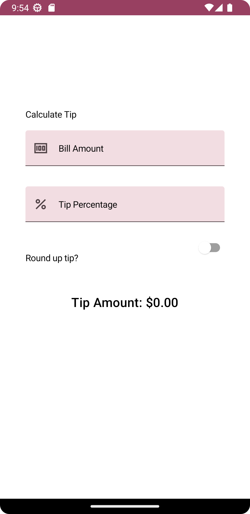

# <h1 align="center">TipCalculator</h1>

   
  

  

⭐ Este projeto é uma introdução ao estado no Compose e fornece a interface do usuário necessária para calcular uma gorjeta com uma porcentagem fixa. 
A caixa de texto Bill amount (valor da conta) permite que o usuário insira o preço do serviço. O app calcula e mostra o valor da gorjeta em um elemento combinável Text. 

## Tela

## Tecnologias usadas e bibliotecas de código aberto

Campos de texto: Material Design 3 - [https://m3.material.io/components/text-fields/guidelines#5c8a5f07-b1a5-455f-bf76-7ff0d724f6b0]
Chave: Material Design 3 - [https://m3.material.io/components/switch/overview]
 

